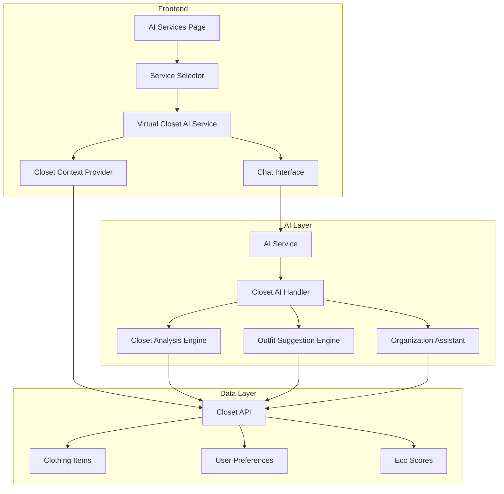

# Design Document: Virtual Closet AI Integration

## Overview

This design integrates the existing Virtual Closet functionality with the AI Services dashboard, creating a specialized AI service that provides intelligent closet management capabilities. The integration leverages the existing AI infrastructure while adding closet-specific functionality through a new service option in the AI Services dropdown.

The solution extends the current AI Services architecture by adding a "Virtual Closet" service that provides conversational AI assistance for wardrobe management, analysis, and optimization. This creates a seamless bridge between the existing Virtual Closet page and AI-powered assistance.

## Architecture

### High-Level Architecture



### Component Integration

The design follows the existing AI Services pattern while adding closet-specific capabilities:

1. **Service Registration**: Virtual Closet is added to the services array in AIServices.tsx
2. **Context Switching**: When selected, the AI assistant switches to closet-focused mode
3. **Data Integration**: The AI service gains access to user's closet data through existing APIs
4. **Specialized Handlers**: New AI handlers process closet-specific requests

## Components and Interfaces

### Frontend Components

#### Enhanced AI Services Page
- **Location**: `client/pages/AIServices.tsx`
- **Modifications**: Add Virtual Closet service to services array
- **New Props**: None (uses existing structure)

```typescript
// Addition to services array
{
  id: "virtual-closet",
  title: "Virtual Closet",
  description: "AI-powered closet management and outfit suggestions",
  icon: Shirt,
  color: "text-indigo-500"
}
```

#### Closet Context Provider
- **Location**: New component `client/components/ClosetContextProvider.tsx`
- **Purpose**: Provides closet data context to AI chat interface
- **Dependencies**: useGetUserCloset hook

```typescript
interface ClosetContextProps {
  userId: string;
  children: React.ReactNode;
}

interface ClosetContextValue {
  closetData: ClothingItem[];
  closetStats: ClosetStats;
  loading: boolean;
  refetch: () => void;
}
```

### Backend Components

#### Closet AI Service
- **Location**: New service `server/services/closetAIService.ts`
- **Purpose**: Handles closet-specific AI requests
- **Dependencies**: aiService, ClothingItem model

```typescript
interface ClosetAIService {
  analyzeCloset(userId: string): Promise<ClosetAnalysis>;
  suggestOutfits(userId: string, criteria: OutfitCriteria): Promise<OutfitSuggestion[]>;
  organizeCloset(userId: string): Promise<OrganizationSuggestions>;
  processClosetQuery(userId: string, query: string): Promise<string>;
}
```

#### AI Route Handler Enhancement
- **Location**: Existing AI routes in `server/routes/`
- **Modifications**: Add closet-specific endpoints
- **New Endpoints**:
  - `POST /ai/closet-analysis`
  - `POST /ai/closet-chat`
  - `POST /ai/closet-suggestions`

## Data Models

### Closet Analysis Result
```typescript
interface ClosetAnalysis {
  totalItems: number;
  categoryDistribution: Record<string, number>;
  colorPalette: ColorAnalysis;
  brandDiversity: BrandAnalysis;
  sustainabilityScore: number;
  gaps: WardrobeGap[];
  underutilized: ClothingItem[];
  recommendations: string[];
}

interface ColorAnalysis {
  dominant: string[];
  missing: string[];
  palette: string;
}

interface BrandAnalysis {
  totalBrands: number;
  topBrands: Array<{ name: string; count: number }>;
  sustainableBrands: string[];
}

interface WardrobeGap {
  category: string;
  description: string;
  priority: 'high' | 'medium' | 'low';
  suggestions: string[];
}
```

### Outfit Suggestion
```typescript
interface OutfitSuggestion {
  id: string;
  name: string;
  items: ClothingItem[];
  occasion: string;
  weather?: string;
  sustainabilityScore: number;
  reasoning: string;
  alternatives: ClothingItem[][];
}

interface OutfitCriteria {
  occasion?: string;
  weather?: string;
  colors?: string[];
  style?: string;
  sustainabilityFocus?: boolean;
}
```

### Organization Suggestions
```typescript
interface OrganizationSuggestions {
  categorization: CategorySuggestion[];
  duplicates: DuplicateGroup[];
  seasonal: SeasonalOrganization;
  maintenance: MaintenanceReminder[];
}

interface CategorySuggestion {
  itemId: string;
  currentCategory: string;
  suggestedCategory: string;
  confidence: number;
  reasoning: string;
}

interface DuplicateGroup {
  items: ClothingItem[];
  similarity: number;
  recommendation: string;
}
```

## Correctness Properties

*A property is a characteristic or behavior that should hold true across all valid executions of a system-essentially, a formal statement about what the system should do. Properties serve as the bridge between human-readable specifications and machine-verifiable correctness guarantees.*

Based on the prework analysis, I've identified several properties that can be tested and a few examples for specific cases. After reviewing for redundancy, here are the key properties:

### Property 1: Service State Management
*For any* AI Services page state, when the Virtual Closet service is selected, the active service state should change to "virtual-closet" and the UI should reflect closet-focused capabilities.
**Validates: Requirements 1.2**

### Property 2: Closet-Only Outfit Suggestions
*For any* outfit suggestion request, all suggested clothing items should exist in the user's virtual closet (no external items should be suggested).
**Validates: Requirements 3.1**

### Property 3: Analysis Completeness
*For any* closet analysis request, the response should include category distribution, color palette information, brand diversity metrics, and eco-score averages.
**Validates: Requirements 2.2**

### Property 4: Contextual Outfit Appropriateness
*For any* outfit suggestion with specified weather, occasion, or preferences, the suggested outfits should be appropriate for those contexts (verified through AI reasoning).
**Validates: Requirements 3.2**

### Property 5: Outfit Quantity and Explanations
*For any* outfit suggestion request where multiple options are possible, the response should contain 3-5 different combinations, each with explanations.
**Validates: Requirements 3.3**

### Property 6: Sustainability Prioritization
*For any* set of possible outfit combinations, those with higher eco-scores should be prioritized in the suggestions.
**Validates: Requirements 3.4**

### Property 7: Natural Language Understanding
*For any* natural language query about colors, brands, categories, or occasions, the AI assistant should correctly identify and search for matching items in the closet.
**Validates: Requirements 5.4**

### Property 8: Duplicate Detection
*For any* closet containing items with high similarity scores (>80%), the service should identify them as potential duplicates and suggest consolidation.
**Validates: Requirements 4.4**

### Property 9: Gap Analysis Actionability
*For any* identified wardrobe gap, the system should provide specific, actionable suggestions for items that would fill that gap.
**Validates: Requirements 2.3**

### Property 10: Sustainability Metrics Calculation
*For any* closet analysis, the system should calculate and report overall sustainability metrics based on the eco-scores of individual items.
**Validates: Requirements 6.1**

<function_calls>
<invoke name="prework">
<parameter name="featureName">virtual-closet-ai-integration

## Error Handling

### AI Service Errors
- **Network Failures**: Graceful degradation with cached responses when possible
- **AI Provider Errors**: Fallback to alternative providers or simplified responses
- **Rate Limiting**: Queue requests and provide user feedback about delays

### Closet Data Errors
- **Empty Closet**: Provide helpful guidance for users with no items
- **Missing Item Data**: Handle incomplete item metadata gracefully
- **API Failures**: Cache closet data locally and sync when connection restored

### User Input Errors
- **Ambiguous Queries**: Ask clarifying questions to better understand user intent
- **Invalid Requests**: Provide helpful error messages and suggest alternatives
- **Context Loss**: Maintain conversation context and recover gracefully from interruptions

### Data Consistency
- **Stale Data**: Implement cache invalidation when closet items are modified
- **Concurrent Updates**: Handle race conditions when multiple operations modify closet data
- **Sync Failures**: Provide retry mechanisms and offline capability

## Testing Strategy

### Dual Testing Approach
This feature requires both unit tests and property-based tests to ensure comprehensive coverage:

**Unit Tests** focus on:
- Specific examples and edge cases
- Integration points between AI services and closet data
- Error conditions and boundary cases
- UI component behavior and state management

**Property-Based Tests** focus on:
- Universal properties that hold across all inputs
- Comprehensive input coverage through randomization
- Correctness properties defined in this document

### Property-Based Testing Configuration
- **Framework**: Use fast-check for TypeScript property-based testing
- **Iterations**: Minimum 100 iterations per property test
- **Test Tags**: Each property test must reference its design document property
- **Tag Format**: `// Feature: virtual-closet-ai-integration, Property {number}: {property_text}`

### Test Categories

#### Frontend Testing
- **Component Tests**: Verify AI Services page correctly displays Virtual Closet option
- **State Management**: Test service selection and context switching
- **Integration Tests**: Verify closet data flows correctly to AI interface

#### Backend Testing
- **API Tests**: Test new closet AI endpoints
- **Service Tests**: Verify closet analysis and suggestion algorithms
- **Integration Tests**: Test AI service integration with closet data

#### End-to-End Testing
- **User Workflows**: Test complete user journeys from service selection to outfit suggestions
- **Data Flow**: Verify data consistency across frontend and backend
- **Error Scenarios**: Test error handling and recovery mechanisms

### Mock Data Strategy
- **Closet Generators**: Create diverse closet configurations for testing
- **AI Response Mocking**: Mock AI provider responses for consistent testing
- **User Scenario Simulation**: Generate realistic user interaction patterns

The testing strategy ensures that both specific examples work correctly (unit tests) and that universal properties hold across all possible inputs (property-based tests), providing comprehensive validation of the Virtual Closet AI integration.