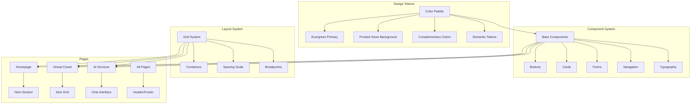

# Design Document: Website Redesign with Clean UI/UX

## Overview

This design transforms the entire EcoWardrobe website with a clean, modern aesthetic using the Evergreen (#1F3A34) and Frosted Snow (#F4F8F9) color palette. The redesign creates a cohesive design system that maintains the eco-friendly brand identity while improving usability, accessibility, and visual appeal across all pages.

The solution builds upon the existing Tailwind CSS and shadcn/ui foundation, updating the color tokens and component styles to implement the new palette while preserving functionality and responsive behavior.

## Architecture

### Design System Architecture



### Color System Integration

The design integrates with the existing CSS custom properties system, updating the color tokens while maintaining the semantic naming structure for easy maintenance and theme switching.

## Components and Interfaces

### Color Palette Definition

#### Primary Colors
- **Evergreen**: #1F3A34 (HSL: 162, 32%, 17%) - Primary brand color
- **Frosted Snow**: #F4F8F9 (HSL: 200, 25%, 97%) - Primary background color

#### Derived Palette
```css
/* Light Theme */
--primary: 162 32% 17%;           /* Evergreen */
--primary-foreground: 200 25% 97%; /* Frosted Snow */
--background: 200 25% 97%;         /* Frosted Snow */
--foreground: 162 32% 17%;         /* Evergreen */
--card: 0 0% 100%;                 /* Pure white for cards */
--muted: 200 20% 92%;              /* Slightly darker than Frosted Snow */
--accent: 162 25% 25%;             /* Lighter Evergreen variant */
--border: 200 15% 88%;             /* Subtle border color */
```

#### Complementary Colors
- **Success**: #2D5A3D (Deeper green for positive actions)
- **Warning**: #B8860B (Warm gold for warnings)
- **Error**: #8B2635 (Muted red for errors)
- **Info**: #1F4A5C (Deep teal for information)

### Typography System

#### Font Hierarchy
```css
/* Headings */
.text-h1 { font-size: 3rem; font-weight: 700; line-height: 1.2; }
.text-h2 { font-size: 2.25rem; font-weight: 600; line-height: 1.3; }
.text-h3 { font-size: 1.875rem; font-weight: 600; line-height: 1.4; }
.text-h4 { font-size: 1.5rem; font-weight: 500; line-height: 1.4; }
.text-h5 { font-size: 1.25rem; font-weight: 500; line-height: 1.5; }
.text-h6 { font-size: 1.125rem; font-weight: 500; line-height: 1.5; }

/* Body Text */
.text-body-lg { font-size: 1.125rem; line-height: 1.6; }
.text-body { font-size: 1rem; line-height: 1.6; }
.text-body-sm { font-size: 0.875rem; line-height: 1.5; }
.text-caption { font-size: 0.75rem; line-height: 1.4; }
```

### Component Specifications

#### Button System
```typescript
interface ButtonVariants {
  primary: {
    background: "hsl(var(--primary))";
    color: "hsl(var(--primary-foreground))";
    hover: "hsl(var(--primary) / 0.9)";
  };
  secondary: {
    background: "hsl(var(--muted))";
    color: "hsl(var(--foreground))";
    hover: "hsl(var(--muted) / 0.8)";
  };
  outline: {
    background: "transparent";
    color: "hsl(var(--primary))";
    border: "1px solid hsl(var(--primary))";
    hover: "hsl(var(--primary) / 0.1)";
  };
}
```

#### Card System
```typescript
interface CardVariants {
  default: {
    background: "hsl(var(--card))";
    border: "1px solid hsl(var(--border))";
    borderRadius: "var(--radius)";
    shadow: "0 1px 3px 0 rgb(0 0 0 / 0.1)";
  };
  elevated: {
    background: "hsl(var(--card))";
    border: "1px solid hsl(var(--border))";
    borderRadius: "var(--radius)";
    shadow: "0 4px 6px -1px rgb(0 0 0 / 0.1)";
  };
}
```

### Layout System

#### Spacing Scale
```css
/* 4px base unit scale */
--space-1: 0.25rem;   /* 4px */
--space-2: 0.5rem;    /* 8px */
--space-3: 0.75rem;   /* 12px */
--space-4: 1rem;      /* 16px */
--space-5: 1.25rem;   /* 20px */
--space-6: 1.5rem;    /* 24px */
--space-8: 2rem;      /* 32px */
--space-10: 2.5rem;   /* 40px */
--space-12: 3rem;     /* 48px */
--space-16: 4rem;     /* 64px */
--space-20: 5rem;     /* 80px */
--space-24: 6rem;     /* 96px */
```

#### Container System
```css
.container-sm { max-width: 640px; }
.container-md { max-width: 768px; }
.container-lg { max-width: 1024px; }
.container-xl { max-width: 1280px; }
.container-2xl { max-width: 1536px; }
```

## Data Models

### Design Token Structure
```typescript
interface DesignTokens {
  colors: {
    primary: ColorToken;
    secondary: ColorToken;
    background: ColorToken;
    foreground: ColorToken;
    muted: ColorToken;
    accent: ColorToken;
    border: ColorToken;
    success: ColorToken;
    warning: ColorToken;
    error: ColorToken;
    info: ColorToken;
  };
  typography: {
    fontFamily: string;
    fontSizes: Record<string, string>;
    fontWeights: Record<string, number>;
    lineHeights: Record<string, number>;
  };
  spacing: Record<string, string>;
  borderRadius: Record<string, string>;
  shadows: Record<string, string>;
}

interface ColorToken {
  value: string;
  hsl: string;
  contrast: string;
}
```

### Component Theme Structure
```typescript
interface ComponentTheme {
  button: ButtonTheme;
  card: CardTheme;
  input: InputTheme;
  navigation: NavigationTheme;
}

interface ButtonTheme {
  variants: Record<string, ButtonVariant>;
  sizes: Record<string, ButtonSize>;
  states: Record<string, ButtonState>;
}
```

## Correctness Properties

*A property is a characteristic or behavior that should hold true across all valid executions of a system-essentially, a formal statement about what the system should do. Properties serve as the bridge between human-readable specifications and machine-verifiable correctness guarantees.*

Based on the prework analysis, I've identified key properties that ensure the design system works correctly across all components and pages. After reviewing for redundancy, here are the essential properties:

### Property 1: Primary Color Consistency
*For any* UI element designated as primary (headers, buttons, key elements), the computed color should be Evergreen (#1F3A34) or its HSL equivalent.
**Validates: Requirements 1.1**

### Property 2: Background Color Consistency
*For any* page or layout background, the computed color should be Frosted Snow (#F4F8F9) or its HSL equivalent.
**Validates: Requirements 1.2**

### Property 3: Accessibility Contrast Compliance
*For any* text and background color combination, the contrast ratio should meet or exceed WCAG AA standards (4.5:1 for normal text, 3:1 for large text).
**Validates: Requirements 1.3, 2.3, 7.1**

### Property 4: Typography Scale Consistency
*For any* heading elements (H1-H6), the font sizes should follow a consistent mathematical scale with proper hierarchy (H1 > H2 > H3 > H4 > H5 > H6).
**Validates: Requirements 2.1, 2.2**

### Property 5: Spacing Scale Mathematical Relationship
*For any* spacing values in the design system, they should follow the 4px base unit scale (multiples of 4px).
**Validates: Requirements 4.1**

### Property 6: Button Style Consistency
*For any* button component, it should have consistent padding, border radius, and hover state transitions regardless of variant.
**Validates: Requirements 3.1**

### Property 7: Interactive Element Feedback
*For any* interactive element (buttons, links, form inputs), it should provide immediate visual feedback on hover and focus states.
**Validates: Requirements 6.1, 6.2, 6.3**

### Property 8: Responsive Breakpoint Consistency
*For any* page layout, it should maintain proper responsive behavior at all defined breakpoints (mobile, tablet, desktop).
**Validates: Requirements 4.3, 5.5**

### Property 9: Touch Target Accessibility
*For any* interactive element, it should have a minimum touch target size of 44px for accessibility compliance.
**Validates: Requirements 7.4**

### Property 10: Semantic Color Token Definition
*For any* semantic color usage (primary, secondary, success, warning, error), the corresponding CSS custom property should be properly defined and accessible.
**Validates: Requirements 1.4, 1.5**
## Error Handling

### Color System Errors
- **Invalid Color Values**: Fallback to default colors when custom properties are undefined
- **Contrast Failures**: Automatic adjustment of text colors when contrast ratios are insufficient
- **Theme Loading**: Graceful degradation to system colors during theme loading

### Component Rendering Errors
- **Missing Styles**: Default styling for components when design system classes fail to load
- **Responsive Failures**: Fallback layouts for unsupported screen sizes
- **Animation Errors**: Disable animations when performance is poor or user prefers reduced motion

### Typography Errors
- **Font Loading**: Fallback to system fonts when custom fonts fail to load
- **Size Calculation**: Default sizes when dynamic typography calculations fail
- **Hierarchy Violations**: Automatic correction of improper heading structures

### Accessibility Errors
- **Focus Management**: Ensure focus indicators are always visible even when styles fail
- **Color Dependency**: Provide alternative indicators when color-only information fails
- **Touch Target**: Automatic padding adjustment when elements are too small

## Testing Strategy

### Dual Testing Approach
This design system requires both unit tests and property-based tests for comprehensive validation:

**Unit Tests** focus on:
- Specific component styling and behavior
- Color value accuracy and contrast calculations
- Typography scale relationships
- Responsive breakpoint behavior
- Accessibility compliance for specific elements

**Property-Based Tests** focus on:
- Universal properties that hold across all components
- Color consistency across different contexts
- Spacing scale mathematical relationships
- Interactive element behavior patterns

### Property-Based Testing Configuration
- **Framework**: Use fast-check for TypeScript property-based testing with custom generators
- **Iterations**: Minimum 100 iterations per property test
- **Test Tags**: Each property test must reference its design document property
- **Tag Format**: `// Feature: website-redesign-clean-ui, Property {number}: {property_text}`

### Test Categories

#### Visual Regression Testing
- **Color Accuracy**: Verify computed colors match design specifications
- **Layout Consistency**: Test component positioning and spacing
- **Typography Rendering**: Validate font sizes, weights, and line heights
- **Responsive Behavior**: Test layouts across all breakpoints

#### Accessibility Testing
- **Contrast Ratios**: Automated testing of all color combinations
- **Keyboard Navigation**: Test focus management and indicators
- **Screen Reader**: Validate semantic HTML structure
- **Touch Targets**: Verify minimum size requirements

#### Performance Testing
- **CSS Loading**: Test design system loading performance
- **Animation Performance**: Validate smooth transitions and animations
- **Responsive Images**: Test image loading across different screen sizes
- **Critical CSS**: Ensure above-the-fold styling loads quickly

#### Cross-Browser Testing
- **Color Rendering**: Test color accuracy across different browsers
- **CSS Support**: Validate modern CSS features with fallbacks
- **Typography**: Test font rendering consistency
- **Interactive Elements**: Verify hover and focus states work consistently

### Mock Data Strategy
- **Color Generators**: Create diverse color combinations for contrast testing
- **Content Generators**: Generate various text lengths and content types
- **Layout Generators**: Create different content structures for responsive testing
- **User Interaction Simulation**: Generate realistic user interaction patterns

The testing strategy ensures that the design system maintains visual consistency, accessibility compliance, and performance standards across all browsers and devices while providing a comprehensive validation framework for the new Evergreen and Frosted Snow color palette implementation.